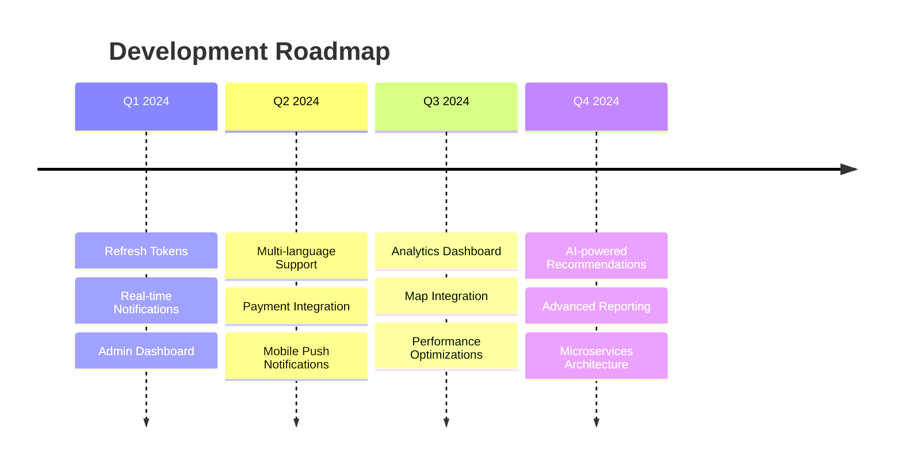

# 🚀 Food Delivery Backend

<div align="center">

**A modern, scalable food delivery API that powers the next generation of food ordering experiences**


[](https://dotnet.microsoft.com/)
[](https://opensource.org/licenses/MIT)
[](https://www.sqlite.org/)
[](https://swagger.io/)

*Built with ASP.NET Core 9 • Inspired by Glovo, Uber Eats, and DoorDash*

</div>

---

## 🎯 What Makes This Special?

This isn't just another CRUD API. It's a **production-ready food delivery platform** that handles everything from user authentication to real-time courier tracking. Whether you're building the next food delivery unicorn or learning modern .NET development, this project has you covered.

### 💡 Why Choose This Backend?

- **🏗️ Enterprise-Ready Architecture** - Clean code, SOLID principles, and scalable design
- **⚡ High Performance** - Optimized queries, efficient data structures, and minimal overhead
- **🔐 Security First** - JWT authentication, role-based authorization, and secure endpoints
- **📱 Mobile-Friendly** - RESTful APIs designed for modern mobile and web applications
- **🌍 Global Ready** - Multi-language and multi-currency support (roadmap)

---

## ✨ Features That Wow

<table>
<tr>
<td width="50%">

### 🔥 Core Functionality
- **Smart Authentication System**
  - JWT-based security
  - Role-based access (Admin/Courier/Customer)
  - Secure password hashing
  
- **Intelligent Order Management**
  - Real-time status tracking
  - Automatic courier assignment
  - Dynamic delivery fee calculation
  - Order history with analytics

- **Advanced Restaurant System**
  - Multi-category product management
  - Real-time menu availability
  - Dynamic pricing with discounts
  - Rich media support (images)

</td>
<td width="50%">

### 🚀 Advanced Features
- **Smart Courier Dispatch**
  - GPS-based location tracking
  - Nearest-available algorithm
  - Performance monitoring
  
- **Social Commerce**
  - Restaurant & courier reviews
  - Star rating system
  - Customer feedback analytics
  
- **Developer Experience**
  - Comprehensive Swagger docs
  - Auto-seeded test data
  - Clean API design
  - Extensive error handling

</td>
</tr>
</table>

---

## 🛠 Built With Cutting-Edge Tech

<div align="center">

| Technology | Purpose | Why We Chose It |
|------------|---------|-----------------|
| **ASP.NET Core 9** | Web Framework | Latest features, high performance, cross-platform |
| **Entity Framework Core 9** | ORM | Code-first approach, excellent tooling |
| **SQLite** | Database | Zero-config development, easy deployment |
| **JWT** | Authentication | Stateless, scalable, industry standard |
| **Swagger/OpenAPI** | Documentation | Interactive API exploration |

</div>

---

## 🚦 Quick Start (3 Minutes!)

### Prerequisites
```bash
✅ .NET 9 SDK
✅ Your favorite IDE (VS Code, Visual Studio, Rider)
✅ 5 minutes of your time
```

### 🎬 Installation

```bash
# 1️⃣ Clone the repository
git clone https://github.com/yourusername/food-delivery-backend.git
cd food-delivery-backend

# 2️⃣ Restore packages (grab a coffee ☕)
dotnet restore

# 3️⃣ Create and seed the database
dotnet ef database update

# 4️⃣ Launch the API 🚀
dotnet run
```

### 🎉 You're Live!

Navigate to `https://localhost:5001/swagger` and explore the interactive API documentation.

**Test it instantly:**
- Register a new user via `/api/auth/register`
- Browse restaurants at `/api/restaurants`
- Place your first order at `/api/orders`

---

## 📊 Database Architecture

<details>
<summary><strong>🏗️ Click to explore our data model</strong></summary>

### Core Entities

```
👤 User
├── Authentication & roles
├── Order history
└── Reviews written

🏪 Restaurant
├── Menu items (Products)
├── Location data
├── Reviews received
└── Order fulfillment

🚚 Courier  
├── GPS coordinates
├── Availability status
├── Active deliveries
└── Performance reviews

📦 Order
├── Cart items
├── Status tracking
├── Delivery details
└── Payment info
```

</details>

---

## 📚 API Documentation

Our API is **fully documented** and **interactive**! 

### 🎯 Key Endpoints

| Endpoint | Purpose | Highlights |
|----------|---------|------------|
| `POST /api/auth/register` | User Registration | Role assignment, validation |
| `GET /api/restaurants` | Browse Restaurants | Filtering, pagination, ratings |
| `POST /api/orders` | Place Order | Cart validation, courier assignment |
| `GET /api/orders/history` | Order History | Personal order tracking |
| `POST /api/reviews` | Leave Review | Restaurant & courier feedback |

### 🔍 Advanced Features
- **Pagination**: All list endpoints support `page` and `pageSize`
- **Filtering**: Search restaurants by cuisine, rating, location
- **Sorting**: Order results by relevance, rating, distance
- **Error Handling**: Consistent error responses with helpful messages

---

## 🌟 What's Coming Next

<div align="center">

### 🚧 Roadmap 2024

</div>



---

## 🎮 Demo Data

The project comes with **rich seed data**:

- 🍕 **15+ Restaurants** across different cuisines
- 🍔 **50+ Menu items** with realistic pricing
- 🚚 **Active couriers** ready for dispatch
- 👥 **Test users** for all roles

Perfect for **immediate testing** and **demo purposes**!

---

## 💻 Development Experience

### 🔥 What Developers Love

- **Hot Reload** - See changes instantly during development
- **Rich IntelliSense** - Full type safety and autocomplete
- **Comprehensive Logging** - Debug with detailed request/response logs
- **Clean Architecture** - Easy to understand, extend, and maintain
- **Unit Test Ready** - Structured for easy testing implementation

### 🛡️ Production Ready

- **Environment Configuration** - Easy deployment across environments
- **Health Checks** - Monitor API health and dependencies
- **CORS Support** - Ready for frontend integration
- **Security Headers** - Protection against common vulnerabilities

---

## 🤝 Contributing

We ❤️ contributions! Here's how you can help:

<table>
<tr>
<td align="center">🐛<br><strong>Bug Reports</strong><br>Found an issue?<br><a href="/issues">Report it!</a></td>
<td align="center">💡<br><strong>Feature Ideas</strong><br>Have a suggestion?<br><a href="/issues">Share it!</a></td>
<td align="center">🔧<br><strong>Code Contributions</strong><br>Want to code?<br><a href="/pulls">Submit a PR!</a></td>
<td align="center">📖<br><strong>Documentation</strong><br>Improve our docs<br><a href="/issues">Help us!</a></td>
</tr>
</table>

### 🎯 Quick Contribution Guide

1. **🍴 Fork** the project
2. **🌿 Create** your feature branch (`git checkout -b feature/AmazingFeature`)
3. **✨ Commit** your changes (`git commit -m 'Add some AmazingFeature'`)
4. **📤 Push** to the branch (`git push origin feature/AmazingFeature`)
5. **🎉 Open** a Pull Request

---

<div align="center">

### 📄 License

This project is licensed under the MIT License

⭐ **Star this repo if it helped you build something amazing!** ⭐

</div>
